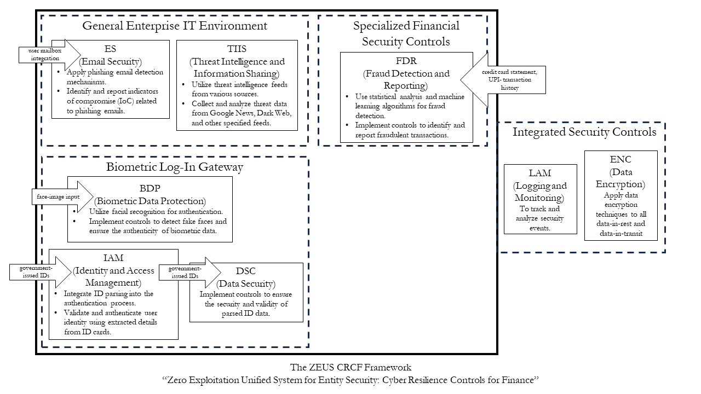

# Zero Exploitation Unified System for Entity Security

## Cyber Resilience Controls Framework for Finance

Welcome to the Zero Exploitation Unified System for Entity Security, a robust Cyber Resilience Controls Framework tailored for the finance industry.

A video explanation of this framework and implementation is available at https://tinyurl.com/zeus-crcf-video

## Overview

This system is designed to provide a unified approach to entity security, ensuring a zero-exploitation environment for financial institutions. The Cyber Resilience Controls Framework (CRCF) integrates various security controls to safeguard against cyber threats and enhance overall resilience. This system provides the security manager with a **SIEM - *Security Events and Incidents Management*** Dashboard for ease of security management.
A framework has been designed to accomodate the same.

## Framework
We have created a framework based on SWIFT CSCF (https://www2.swift.com/knowledgecentre/rest/v1/publications/cscf_dd/49.0/CSCF_v2023_20221021.pdf) by mapping the elements of each tool to relevant security controls. The SWIFT CSCF consists of both mandatory and advisory security controls which are based on industry-standard frameworks, such as NIST, ISO 27000 and PCI-DSS. 

### 1. Fraud Detection from Transaction History
  - **Fraud Detection and Reporting (FDR):**
    - Use statistical analysis and machine learning algorithms for fraud detection.
    - Implement controls to identify and report fraudulent transactions.
  
### 2. Real VS Fake Faces
  - **Biometric Data Protection (BDP):**
    - Utilize facial recognition for authentication.
    - Implement controls to detect fake faces and ensure the authenticity of biometric data.
  
### 3. ID Parsing
- **SWIFT CSCF Controls:**
  - **Identity and Access Management (IAM):**
    - Integrate ID parsing into the authentication process.
    - Validate and authenticate user identity using extracted details from ID cards.
  - **Data Security (DSC):**
    - Implement controls to ensure the security and validity of parsed ID data.

### 4. Phishing Email Detection
  - **Email Security (ES):**
    - Apply phishing email detection mechanisms.
    - Identify and report indicators of compromise (IoC) related to phishing emails.

### 5. Threat Intelligence
  - **Threat Intelligence and Information Sharing (TIIS):**
    - Utilize threat intelligence feeds from various sources.
    - Collect and analyze threat data from Google News, Dark Web, and other specified feeds.

### 6. Facial Recognition Log-In Gateway
  - **Biometric Data Protection (BDP):**
    - Implement facial recognition for user authentication.
    - Ensure the integrity and authenticity of the facial recognition process.
  - **Identity and Access Management (IAM):**
    - Integrate facial recognition with user CRUD operations and database interactions.

### General Recommendations:
- **Logging and Monitoring (LAM):**
  - Implement logging and monitoring mechanisms to track and analyze security events.
- **Data Encryption (ENC):**
  - Apply encryption techniques, especially when dealing with sensitive data.

## Features

- **Fraud Detection from Transaction History (FDR):**
  - Utilize statistical analysis and machine learning algorithms for fraud detection.
  - Analyze transaction data from various sources, including UPI, credit card histories, and Ethereum transactions.

- **Real vs. Fake Faces (BDP, IAM, DSC):**
  - Implement facial recognition for secure user authentication.
  - Detect and differentiate real faces from fake ones, ensuring the authenticity of biometric data.

- **ID Parsing (IAM, DSC):**
  - Extract and validate user details from identification documents such as Aadhar, Driver License, Passport, and PAN Card.
  - Ensure the security and validity of parsed ID data.

- **Phishing Email Detection (ES):**
  - Analyze email files to identify phishing attempts.
  - Extract indicators of compromise (IoC) and distinguish between phishing and safe emails.

- **Threat Intelligence (TIIS):**
  - Gather threat intelligence from various sources, including Google News, Dark Web, CISA Automated Indicator Sharing (AIS), and AlienVault OTX Threat Intelligence Feed.

- **Facial Recognition Log-In Gateway (BDP, IAM, DSC):**
  - Allow users to log in securely using facial recognition.
  - Perform CRUD operations for users, store ID with face embeddings, and collaborate with ID parsing for enhanced security.

## Screenshots

### Dashboard

### CRCF Matrix Mapping

### Create SIEM Investigation

### Ongoing SIEM Investigations

### SIEM Investigation-Specific View

### All SIEM Investigations

### Face Database

### Government ID Validation

## Contributors
- Aaditya (aadityarenga@gmail.com)
- Likith (21z216@psgtech.ac.in)
- Aadil (21z201@psgtech.ac.in)
- Gaurav (gaurav.vishnu11@gmail.com)
- Mithilesh (mithileshen0979@gmail.com)
